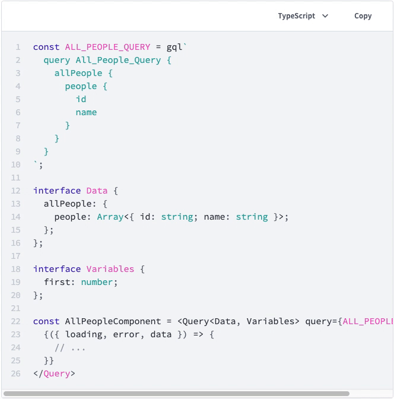

# gatsby-remark-typescript

[](https://travis-ci.com/trevorblades/gatsby-remark-typescript)

Transforms TypeScript code blocks to JavaScript and inserts them into the page

- [Installation](#installation)
- [Usage](#usage)
- [Options](#options)
  - [`prettierOptions`](#prettieroptions)
  - [`wrapperComponent` (MDX only)](#wrappercomponent-mdx-only)
- [License](#license)

## Installation

```bash
npm install gatsby-remark-typescript
```

## Usage

```js
// gatsby-config.js
module.exports = {
  plugins: [
    {
      resolve: 'gatsby-transformer-remark',
      plugins: ['gatsby-remark-typescript']
    }
  ]
};
```

## Options

By default, `gatsby-remark-typescript` will visit *all* TypeScript code blocks in your site and insert the transformed and formatted JavaScript after each of them. You can affect this default behaviour and formatting settings using options supplied to this plugin.

### `prettierOptions`

An object of options supplied to `prettier.format` when formatting the JS output. See [Prettier's docs](https://prettier.io/docs/en/options) for more information.

```js
// gatsby-config.js
module.exports = {
  plugins: [
    {
      resolve: 'gatsby-transformer-remark',
      options: {
        plugins: [
          {
            resolve: 'gatsby-remark-typescript',
            options: {
              prettierOptions: {
                semi: false,
                singleQuote: false
              }
            }
          }
        ]
      }
    }
  ]
};
```

### `wrapperComponent` (MDX only)

A string representing the name of the React component used to wrap code blocks that you wish to transform. This feature allows the author to choose which TypeScript code blocks to transform by wrapping them in some JSX.

```js
// gatsby-config.js
module.exports = {
  plugins: [
    {
      resolve: 'gatsby-plugin-mdx',
      options: {
        gatsbyRemarkPlugins: [
          {
            resolve: 'gatsby-remark-typescript',
            options: {
              // configure the JSX component that the plugin should check for
              wrapperComponent: 'CodeBlockWrapper'
            }
          }
        ]
      }
    }
  ]
};
```

In your MDX file, surround code blocks that you want to be transformed with their own pair of opening and closing JSX tags. The name of the component that you use here must match the `wrapperComponent` option that you passed along to this plugin.

````jsx
import {CodeBlockWrapper} from '../components';

<CodeBlockWrapper>

```ts
// this code block will be transformed
```

</CodeBlockWrapper>

```ts
// this one will be ignored
```
````

Your wrapper component could include some additional logic, like allowing users to switch between the original and transformed code blocks. Check out Apollo's [`MultiCodeBlock` component](https://github.com/apollographql/gatsby-theme-apollo/blob/master/packages/gatsby-theme-apollo-docs/src/components/multi-code-block.js) for an example of how to accomplish this.



## License

[MIT](./LICENSE)
